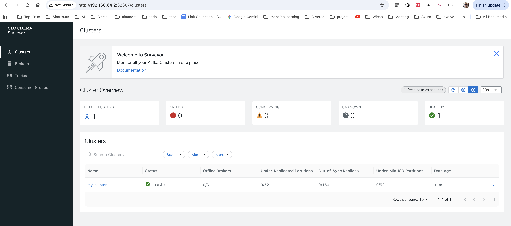

# Setup of Cloudera Streams Messaging 

Following steps deploy CSM on Minikube running on your Macbook.

## Pre-requisites

- Following packages need to be installed: Docker (or podman), Minikube, helm
- valid cloudera license and its corresponding user name and password, generated on www.cloudera.com in the download section.

If you clone this repository and also add the license file in the directory, the below commands should work without much changes.

In case of podman make sure that the virtual machine is big enough.

```
podman machine init --cpus 6 --memory 14336
podman machine start
```

## Setup

Open a terminal window and Spin up Minikube with enough resources for the full stack

```
minikube start --cpus 4 --memory 12288
```
Define following environmental variables that will be used in the subsequent commands

```
export CLOUDERA_LICENSE_USER="<Your_User_Name>"
export CLOUDERA_LICENSE_PASSWORD="<Your_User_password>"
```
## Installing Strimzi with Helm

Create a namespace in your Kubernetes cluster

```
kubectl create namespace cld-streaming
```
Log in into the cloudera docker registry with helm

```
helm registry login container.repository.cloudera.com -u "$CLOUDERA_LICENSE_USER" -p "$CLOUDERA_LICENSE_PASSWORD"
```
Create a Kubernetes secret containing your cloudera credentials

```
kubectl create secret docker-registry cloudera-creds \
  --namespace cld-streaming \
  --docker-server=container.repository.cloudera.com \
  --docker-username="$CLOUDERA_LICENSE_USER" \
  --docker-password="$CLOUDERA_LICENSE_PASSWORD" 
```
Install Strimzi with helm install
```
helm install strimzi-cluster-operator \
  --namespace cld-streaming \
  --set 'image.imagePullSecrets[0].name=cloudera-creds' \
  --set-file clouderaLicense.fileContent=<Your_license_file_name> \
  --set watchAnyNamespace=true \
  oci://container.repository.cloudera.com/cloudera-helm/csm-operator/strimzi-kafka-operator \
  --version 1.6.0-b99
```

Verify your installation
```
kubectl get deployments --namespace cld-streaming
```

```
kubectl get pods --namespace cld-streaming
```

## Deploy a kafka cluster

The repository contains following 3 yaml files with a configuration as documented in the product documentation:
kafka.yaml, broker.yaml, controller.yaml (Refer to this [documentation link](https://docs.cloudera.com/csm-operator/1.6/kafka-deploy-configure/topics/csm-op-deploying-kafka.html) for a detailed discussion on configuration parameters)

Deploy the cluster

```
kubectl apply \
  --filename Kafka.yaml,broker.yaml,controller.yaml \
  --namespace cld-streaming
```

Verify that the pods are created.

```
kubectl get pods --namespace cld-streaming
```


## Validate the kafka cluster

Create a topic 

```
IMAGE=$(kubectl get pod my-cluster-broker-0  --namespace cld-streaming --output jsonpath='{.spec.containers[0].image}')
kubectl run kafka-admin -it \
  --namespace cld-streaming \
  --image=$IMAGE \
  --rm=true \
  --restart=Never \
  --command -- /opt/kafka/bin/kafka-topics.sh \
    --bootstrap-server my-cluster-kafka-bootstrap:9092 \
    --create \
    --topic my-topic
```

Produce messages to the topic by starting the starting the producer and typing a few words

```
kubectl run kafka-producer -it \
  --namespace cld-streaming \
  --image=$IMAGE \
  --rm=true \
  --restart=Never \
  --command -- /opt/kafka/bin/kafka-console-producer.sh \
    --bootstrap-server my-cluster-kafka-bootstrap:9092 \
    --topic my-topic
```

```
>hello
>csm
>operator
>^C
```

Consume the messages

```
kubectl run kafka-consumer -it \
  --namespace cld-streaming \
  --image=$IMAGE \
  --rm=true \
  --restart=Never \
  --command -- /opt/kafka/bin/kafka-console-consumer.sh \
    --bootstrap-server my-cluster-kafka-bootstrap:9092 \
    --topic my-topic \
    --from-beginning
```

## Deploy Surveyor

Obtain the bootstrap servers

```
kubectl get kafka my-cluster -n cld-streaming -o jsonpath='{.status.listeners[?(@.name=="plain")].bootstrapServers}'
```

Create a file surveyor.yaml with below settings, for bootstrapservers take the value you just obtained with the previous command

```
clusterConfigs:
  clusters:
    - clusterName: my-cluster
      tags:
        - csm1.6
      bootstrapServers: my-cluster-kafka-bootstrap.cld-streaming.svc:9092 
      adminOperationTimeout: PT1M
      authorization:
        enabled: false
      commonClientConfig:
        security.protocol: PLAINTEXT
surveyorConfig:
  surveyor:
    authentication:
      enabled: false
tlsConfigs:
  enabled: false
```

Install cloudera Surveyor with helm install

```
helm install cloudera-surveyor \
  --namespace cld-streaming \
  --values surveyor.yaml \
  --set 'image.imagePullSecrets=cloudera-creds' \
  --set-file clouderaLicense.fileContent=<Your_license_file_name>  \
  oci://container.repository.cloudera.com/cloudera-helm/csm-operator/surveyor \
  --version 1.6.0-b99
```


```
minikube service cloudera-surveyor-service --namespace cld-streaming
```

Now all settings can be made over the UI.


<br/>

<br/>


## Deploy Schema Registry

Create the sr-values.yaml files with following values

```
tls:
  enabled: false
authentication:
  oauth:
    enabled: false
authorization:
  simple:
    enabled: false
database:
  type: in-memory
service:
  type: NodePort
```

Execute following helm command to install Schema Registry

```
helm install schema-registry \
--namespace cld-streaming \
--version 1.6.0-b99 \
--values sr-values.yaml \
--set "image.imagePullSecrets[0].name=cloudera-creds" \
oci://container.repository.cloudera.com/cloudera-helm/csm-operator/schema-registry 
```

## Deploy a telecommunication use case on the deployed kafka cluster and Schema Registry

Following telecommunication use case shows:
- K8s Operator Abstraction: Topic management and streaming infrastructure running natively via CSM Operator CRDs.
- Dynamic Schema Resolution: Both Producer and Consumer dynamically communicate over HTTP REST with Cloudera Schema Registry using the Cloudera SerDe Wire Protocol (0x01 magic byte + 8-byte schemaVersionId header).
- Data Quality & Governance: The Producer client validates payloads locally against Schema Version ID 3 (telecom-cdr-avro), preventing invalid events (e.g., corrupted call_type enums) from polluting Kafka.
- End-to-End Deserialization: The Consumer resolves Schema Version ID 3 dynamically from the registry and parses incoming Avro binary byte payloads back into structured Telecom CDR records.

Configuration & Target Schema: Sets up the internal Kubernetes endpoints (schema-registry-service on port 9090, my-cluster-kafka-bootstrap on port 9092) and defines the telecom-cdr-avro target schema structure containing Call Detail Record fields (call_id, subscriber_id, cell_tower_id, call_type, duration_seconds, data_volume_mb, event_timestamp).

Schema Resolution & Dynamic Creation (ensure_schema_exists): Checks whether telecom-cdr-avro exists in the Cloudera Schema Registry via REST API. If found, it fetches the latest active Version ID and Avro definition; if missing, it registers both the schema metadata and Version 1 automatically using a POST request.

Cloudera SerDe Protocol Headers (pack_cloudera_header / unpack_cloudera_header): Implements binary byte packing/unpacking using struct.pack(">Bq", ...) to prepending a 9-byte wire header (0x01 magic byte + 8-byte big-endian schemaVersionId) to all serialized Avro payloads.

CDR Event Generators (generate_valid_cdr / generate_malformed_cdr): Provides mock data generators for realistic Telecom events (VOICE, SMS, DATA) and intentionally bad events (unsupported 5G_VIDEO enum value, non-numeric duration string) used to demonstrate data governance contract enforcement.

Producer Pipeline (run_producer): Runs an infinite streaming loop that validates CDR records against the schema locally via fastavro.validate. Valid records are serialized into binary Avro, tagged with the Cloudera wire header, and published to Kafka; invalid records are caught and rejected client-side before reaching the brokers.

Consumer Pipeline (run_consumer): Subscribes to the Kafka topic, extracts the 8-byte schemaVersionId from incoming message headers, dynamically fetches and caches un-cached schemas from the Registry, and deserializes the Avro binary payloads back into structured JSON CDR records.


Start the kafka producer pod and the kafka consumer pod with following command

```
kubectl apply -f cdr-demo-pod.yaml -n cld-streaming  
```

To stop the kafka clients run following command

```
kubectl delete -f cdr-demo-pod.yaml -n cld-streaming 
```


